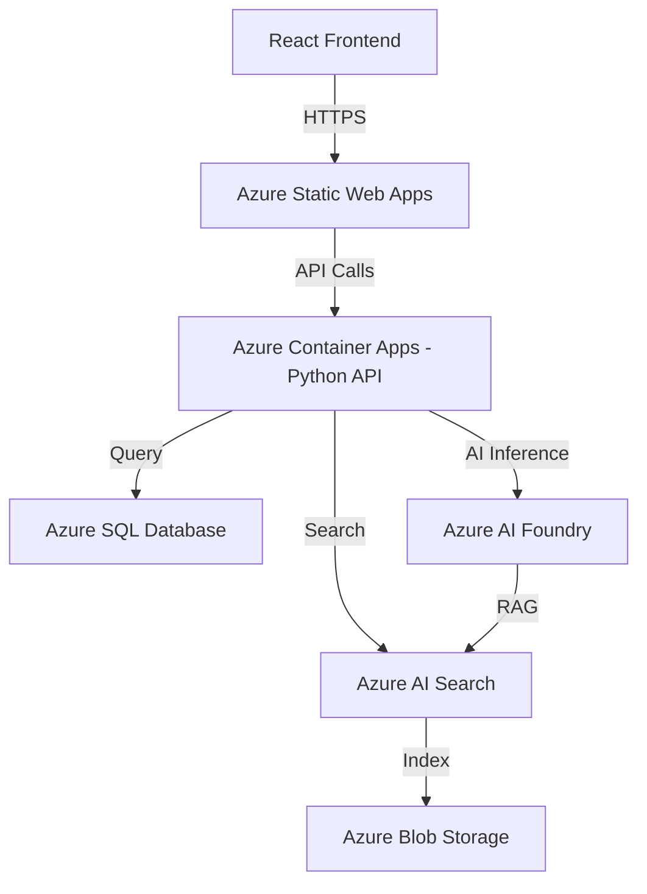

# Lab 3: Model Usage & Agents

## 🎯 Learning Objectives

By the end of this lab, you will:
- Understand the model catalog and how to choose the right model
- Make API calls with different parameters
- Build a basic AI agent with tool calling
- Generate architecture diagrams using AI models

---

## 📑 Table of Contents

| # | Exercise | Type |
|---|----------|------|
| 1 | [Model Catalog Overview](#model-catalog-overview) | Concepts |
| 2 | [Exercise 1: Experiment with Reasoning Effort](#exercise-1-experiment-with-reasoning-effort) | 🌐 Portal / 🐍/.NET Code |
| 3 | [Exercise 2: Streaming Responses](#exercise-2-streaming-responses) | 🐍/.NET API |
| 4 | [What is an Agent?](#what-is-an-agent) | Concepts |
| 5 | [Build Your First Agent — Portal](#-option-a-create-an-agent-via-the-foundry-portal-no-code) | 🌐 Portal |
| 6 | [Build Your First Agent — Code](#-net-option-b-create-an-agent-via-sdk) | 🐍/.NET Code |
| 7 | [Exercise 4: Agent with Code Interpreter](#exercise-4-agent-with-code-interpreter-tool) | 🌐 Portal / 🐍/.NET Code |
| 8 | [Architecture Diagram Generation — Portal](#-method-0-generate-diagrams-in-the-foundry-playground-no-code) | 🌐 Portal |
| 9 | [Architecture Diagram Generation — Code](#-net-method-1-generate-mermaid-diagrams-with-gpt-41) | 🐍/.NET Code |
| 10 | [🧪 Challenge: Architecture Advisor](#-challenge-exercise) | Challenge |

---

## Model Catalog Overview

### Popular Models for Different Tasks (June 2026)

| Model | Best For | Context | Strengths |
|-------|----------|---------|-----------|
| **GPT-4.1** | Complex reasoning, coding, long-context | 1M tokens | SOTA coding & instruction-following, fine-tunable |
| **GPT-4.1-mini** | Cost-effective general tasks | 1M tokens | Fast, affordable, great quality |
| **GPT-4.1-nano** | Ultra-low-latency, edge scenarios | 1M tokens | Smallest/fastest in the 4.1 family |
| **gpt-5.1** | Multimodal (text + image + audio) | 128K tokens | Real-time audio, vision, fastest multimodal |
| **o3** | Advanced math, logic, planning | 200K tokens | Deep chain-of-thought reasoning |
| **o4-mini** | Visual reasoning, cost-efficient reasoning | 200K tokens | Strong reasoning at lower cost |
| **gpt-image-1** | Image generation & editing | — | Text-to-image, inpainting, style transfer |
| **text-embedding-3-large** | Embeddings for RAG | 8K tokens | Best quality embeddings (3072 dimensions) |
| **text-embedding-3-small** | Cost-effective embeddings | 8K tokens | Good quality, lower cost (1536 dimensions) |
| **Phi-4** | On-device/edge AI | 16K tokens | Small, fast, open-source (Microsoft) |

> ⚠️ **Note:** DALL-E 3 was retired in early 2026. Use **gpt-image-1** (or gpt-image-1-mini) for all image generation tasks.

### Choosing a Model — Decision Matrix

```
Need complex reasoning/coding?  → GPT-5.1
Need it cheap & fast?           → GPT-5-mini 
Need multimodal (vision+audio)? → gpt-5.1
Need deep math/logic reasoning? → o4-mini
Need image generation?          → gpt-image-1
Need embeddings for RAG?        → text-embedding-3-large (quality) or 3-small (cost)
Need code generation?           → GPT-5-codex (1M context, best for code)
Need diagram/visual?            → GPT-5.1 (Mermaid/PlantUML) + gpt-image-1
Need long documents (>128K)?    → GPT-5.1 (1M token context)
```

---

## 🖥️ Hands-On: API Parameters Deep Dive

### Exercise 1: Experiment with Reasoning Effort

> ⚠️ **GPT-5.1 does not support the `temperature` parameter.** Use `reasoning_effort` to control how much reasoning the model performs before answering.

#### 🌐 Portal Option

1. Go to [ai.azure.com](https://ai.azure.com) → your project → **Playgrounds** → **Chat**
2. Select your **GPT-5.1** deployment
3. In the chat, type: *"A team has 8 hours to build an AI prototype. Prioritize these tasks and explain the tradeoffs: data preparation, prompt design, evaluation, UI, and deployment."*
4. On the right panel, set **Reasoning effort** to `none` → press Send
5. **Clear chat**, ask the same question with Reasoning effort `low` → Send
6. **Clear chat**, ask the same question with Reasoning effort `high` → Send
7. Compare the responses, response times, and token usage

> 💡 **Key insight**: Higher reasoning effort can improve analysis on complex tasks, but it can also increase latency and token usage. Use the lowest effort that consistently meets your quality requirements.

#### 🐍 / .NET Code Option

<div class="language-tabs" data-language-tabs markdown="1">
<div class="language-tab-panel" data-language="Python" data-language-id="python" markdown="1">
<p class="language-tab-label"><strong>Python</strong></p>

```python
import os
import time
from dotenv import load_dotenv
from azure.identity import DefaultAzureCredential, get_bearer_token_provider
from openai import OpenAI

load_dotenv()

endpoint = os.getenv("AZURE_OPENAI_ENDPOINT")
deployment = os.getenv("AZURE_OPENAI_DEPLOYMENT", "gpt-5.1")

token_provider = get_bearer_token_provider(
    DefaultAzureCredential(), "https://ai.azure.com/.default"
)
client = OpenAI(base_url=f"{endpoint.rstrip('/')}/openai/v1", api_key=token_provider)

prompt = """A team has 8 hours to build an AI prototype. Prioritize these tasks
and explain the tradeoffs: data preparation, prompt design, evaluation, UI,
and deployment."""

# Try different reasoning effort levels supported by GPT-5.1
# (never combine `reasoning_effort` with `temperature` on GPT-5.1 -- it isn't supported)
for effort in ["none", "low", "high"]:
    start = time.perf_counter()
    response = client.chat.completions.create(
        model=deployment,
        messages=[{"role": "user", "content": prompt}],
        reasoning_effort=effort,
        max_completion_tokens=500
    )
    elapsed = time.perf_counter() - start

    print(f"\nReasoning effort: {effort}")
    print(f"Elapsed time: {elapsed:.2f} seconds")
    print(f"Token usage: {response.usage}")
    print(response.choices[0].message.content)
```

</div>
<div class="language-tab-panel" data-language=".NET" data-language-id="dotnet" markdown="1">
<p class="language-tab-label"><strong>.NET</strong></p>

```csharp
using System.Diagnostics;
using Azure.Identity;
using OpenAI;
using OpenAI.Chat;
using System.ClientModel.Primitives;

#pragma warning disable OPENAI001

string endpoint = Environment.GetEnvironmentVariable("AZURE_OPENAI_ENDPOINT")
    ?? throw new InvalidOperationException("Set AZURE_OPENAI_ENDPOINT.");
string deployment = Environment.GetEnvironmentVariable("AZURE_OPENAI_DEPLOYMENT") ?? "gpt-5.1";

BearerTokenPolicy tokenPolicy = new(new DefaultAzureCredential(), "https://ai.azure.com/.default");
ChatClient client = new(
    model: deployment,
    authenticationPolicy: tokenPolicy,
    options: new OpenAIClientOptions { Endpoint = new Uri($"{endpoint.TrimEnd('/')}/openai/v1/") });

string prompt = """
    A team has 8 hours to build an AI prototype. Prioritize these tasks
    and explain the tradeoffs: data preparation, prompt design, evaluation, UI,
    and deployment.
    """;

// Try different reasoning effort levels supported by GPT-5.1.
// Never set `Temperature` alongside `ReasoningEffortLevel` on GPT-5.1 -- it isn't supported.
foreach (var effort in new[] { ChatReasoningEffortLevel.Minimal, ChatReasoningEffortLevel.Low, ChatReasoningEffortLevel.High })
{
    var stopwatch = Stopwatch.StartNew();
    ChatCompletionOptions options = new()
    {
        ReasoningEffortLevel = effort,
        MaxOutputTokenCount = 500
    };

    ChatCompletion completion = client.CompleteChat([new UserChatMessage(prompt)], options);
    stopwatch.Stop();

    Console.WriteLine($"\nReasoning effort: {effort}");
    Console.WriteLine($"Elapsed time: {stopwatch.Elapsed.TotalSeconds:F2} seconds");
    Console.WriteLine($"Token usage: {completion.Usage.TotalTokenCount}");
    Console.WriteLine(completion.Content[0].Text);
}
```

> The Foundry `v1` API surface does not expose a `none` reasoning effort level for
> GPT-5.1 in the .NET SDK enum; `Minimal` is the lowest supported value.

</div>
</div>

### Exercise 2: Streaming Responses

> ⚠️ **Streaming is an API feature and is not available as an option in the Foundry playground.** Complete this exercise with the API (Python or .NET).

#### 🐍 / .NET API

<div class="language-tabs" data-language-tabs markdown="1">
<div class="language-tab-panel" data-language="Python" data-language-id="python" markdown="1">
<p class="language-tab-label"><strong>Python</strong></p>

```python
# Streaming — get tokens as they're generated (great for chat UIs)
stream = client.chat.completions.create(
    model=deployment,
    messages=[
        {"role": "system", "content": "You are a helpful assistant."},
        {"role": "user", "content": "Explain microservices architecture in 5 bullet points."}
    ],
    stream=True
)

print("Streaming response:")
for chunk in stream:
    if chunk.choices[0].delta.content:
        print(chunk.choices[0].delta.content, end="", flush=True)
print()
```

1. Run the code and observe that text appears incrementally instead of all at once.
2. Change `stream=True` to `stream=False`. Update the code to print
   `response.choices[0].message.content`, then run it again.
3. Compare the perceived response time. With streaming, the application can display
   content before the complete response is ready.

</div>
<div class="language-tab-panel" data-language=".NET" data-language-id="dotnet" markdown="1">
<p class="language-tab-label"><strong>.NET</strong></p>

```csharp
using OpenAI.Chat;

// Streaming -- get tokens as they're generated (great for chat UIs)
CollectionResult<StreamingChatCompletionUpdate> updates = client.CompleteChatStreaming(
    new SystemChatMessage("You are a helpful assistant."),
    new UserChatMessage("Explain microservices architecture in 5 bullet points."));

Console.WriteLine("Streaming response:");
foreach (StreamingChatCompletionUpdate update in updates)
{
    foreach (ChatMessageContentPart part in update.ContentUpdate)
    {
        Console.Write(part.Text);
    }
}
Console.WriteLine();
```

1. Run the code and observe that text appears incrementally instead of all at once.
2. Compare `CompleteChatStreaming` (above) with the non-streaming `CompleteChat` from
   Exercise 1 — with streaming, the application can display content before the
   complete response is ready.
3. An async equivalent, `CompleteChatStreamingAsync`, is available for use inside
   `await foreach` loops in ASP.NET or other async apps.

</div>
</div>

> 💡 **Key insight**: The API returns an iterator of response chunks when streaming is enabled. Production applications can forward those chunks to a UI as they arrive.

---

## 🤖 Building AI Agents


### What is an Agent?

An **AI Agent** is an autonomous system that can:
1. **Understand** user intent from natural language
2. **Plan** multi-step actions to accomplish goals
3. **Use tools** (search, code execution, APIs) to gather information
4. **Respond** with grounded, actionable answers

### Agent Architecture

```
User Query
    │
    ▼
┌─────────────────┐
│   Agent Brain   │ ← LLM (gpt-5.1)
│  (Reasoning)    │
└────────┬────────┘
         │
    ┌────┴────┐
    │  Tools  │
    ├─────────┤
    │ • Code Interpreter    │
    │ • File Search (RAG)   │
    │ • Function Calling    │
    │ • Azure AI Search     │
    │ • Custom APIs         │
    └─────────────────────────┘
         │
         ▼
   Grounded Response
```

---

> 📌 **Terminology: Prompt Agents vs. Classic Agents**
>
> Microsoft Foundry has had more than one "Agents" API shape over time. This lab uses
> the **current, supported surface for this repo's pinned SDK versions** (`azure-ai-projects`
> 2.x in Python, and the OpenAI `Responses` API in .NET):
>
> - **Prompt Agents (used below)** — a named, versioned agent resource (`agents.create_version`)
>   defined by a model + instructions + tools, invoked through the standard OpenAI **Responses**
>   API (`responses.create(..., extra_body={"agent_reference": {...}})`). This is the
>   actively developed path and what the code samples in this lab and in `sample-code/`
>   use.
> - **Classic Agents (older pattern, not used here)** — the original thread/run-based
>   surface (`agents.create_agent`, `agents.create_thread`, `agents.create_and_process_run`),
>   modeled on the now-deprecated OpenAI Assistants API. If you see samples elsewhere using
>   those method names, treat them as legacy references — they are **not** exposed by the
>   `azure-ai-projects` version pinned in this repo's `requirements.txt`.
>
> The Foundry **portal** experience (Option A below) is the same regardless of which
> SDK surface you later call it from, so the portal walkthrough is shared across languages.

## 🖥️ Hands-On: Building Your First Agent

### 🌐 Option A: Create an Agent via the Foundry Portal (No Code)

> This approach is ideal for quickly prototyping and testing agents without writing code.

#### Step 1: Open the Agent Builder
1. Go to [ai.azure.com](https://ai.azure.com) → your project
2. Click **Agents** in the left navigation
3. Click **+ New agent**

#### Step 2: Configure the Agent
1. **Name**: `HackathonHelper`
2. **Model**: Select your deployed GPT-4.1 (or GPT-4.1-mini)
3. **Instructions** (paste into the System message box):
   ```
   You are a helpful hackathon assistant for Azure AI Foundry.
   Your capabilities:
   - Explain Azure AI concepts clearly
   - Provide Python code examples
   - Help debug common issues
   - Suggest best practices
   Keep responses concise and practical. Always include code when relevant.
   ```

#### Step 3: Add Tools
1. In the **Tools** section, click **+ Add tool**
2. Select **Code Interpreter** — enables the agent to execute Python code
3. (Optional) Select **File Search** — enables RAG over uploaded files

#### Step 4: Test the Agent
1. Click **Try in playground** (or the chat panel on the right)
2. Ask: *"What's the difference between an embedding and a completion model?"*
3. Observe the agent reasoning and responding
4. Try: *"Write Python code to generate embeddings using Azure OpenAI"* — the agent will use Code Interpreter

#### Step 5: Upload Files for File Search (Optional)
1. In the agent config, under **File Search**, click **+ Add data source**
2. Upload the sample documents from `data/sample-docs/`
3. The agent will now answer questions grounded in your documents

#### Step 6: Save & Deploy
1. Click **Save** to save your agent configuration
2. Note the **Agent ID** — you'll use this if calling from code later
3. You can share the agent with teammates via the portal

---

### 🐍 / .NET Option B: Create an Agent via SDK

### Exercise 3: Basic Agent with Azure AI Foundry

<div class="language-tabs" data-language-tabs markdown="1">
<div class="language-tab-panel" data-language="Python" data-language-id="python" markdown="1">
<p class="language-tab-label"><strong>Python</strong></p>

```python
import os
from dotenv import load_dotenv
from azure.identity import DefaultAzureCredential
from azure.ai.projects import AIProjectClient
from azure.ai.projects.models import PromptAgentDefinition

load_dotenv()

AGENT_NAME = "HackathonHelper"
deployment = os.getenv("AZURE_OPENAI_DEPLOYMENT", "gpt-5.1")

with (
    DefaultAzureCredential() as credential,
    AIProjectClient(endpoint=os.getenv("PROJECT_ENDPOINT"), credential=credential) as client,
):
    # Step 1: Register (or update) a Prompt Agent -- a named, versioned agent resource.
    agent_version = client.agents.create_version(
        AGENT_NAME,
        definition=PromptAgentDefinition(
            model=deployment,
            instructions="""You are a helpful hackathon assistant. You help developers
            understand Azure AI services and write code. Be concise and practical.
            Always provide code examples when relevant.""",
        ),
    )
    print(f"Agent created: {AGENT_NAME} (version {agent_version.version})")

    # Step 2: Invoke the agent through the standard OpenAI Responses API.
    with client.get_openai_client() as openai_client:
        response = openai_client.responses.create(
            model=deployment,
            input="How do I create a RAG pipeline with Azure AI Search? Give me the key steps.",
            extra_body={"agent_reference": {"name": AGENT_NAME, "type": "agent_reference"}},
        )
        print(f"\nAgent Response:\n{response.output_text}")

        # Step 3: Continue the same conversation with `previous_response_id`.
        follow_up = openai_client.responses.create(
            model=deployment,
            input="Now show me the Python code to query that index.",
            previous_response_id=response.id,
            extra_body={"agent_reference": {"name": AGENT_NAME, "type": "agent_reference"}},
        )
        print(f"\nAgent Response:\n{follow_up.output_text}")

    # Cleanup
    client.agents.delete(AGENT_NAME, force=True)
    print("\nAgent cleaned up.")
```

</div>
<div class="language-tab-panel" data-language=".NET" data-language-id="dotnet" markdown="1">
<p class="language-tab-label"><strong>.NET</strong></p>

> The Python sample above registers the agent as a named, versioned resource in Foundry
> (`agents.create_version`) using the `azure-ai-projects` package. The .NET sample below
> implements equivalent agent behavior (instructions + multi-turn conversation) directly
> against the OpenAI **Responses** API, which is already fully supported by `OpenAI` 2.12.0
> -- it does not require adding an `Azure.AI.Projects` package dependency to get a working
> "Prompt Agent"-style experience. If you need a Foundry-managed, named/versioned agent
> resource from .NET, use the Foundry portal (Option A) or the `Azure.AI.Projects` NuGet
> package, checking its current API surface before relying on exact method names.

```csharp
using Azure.Identity;
using OpenAI;
using OpenAI.Responses;
using System.ClientModel.Primitives;

#pragma warning disable OPENAI001

string endpoint = Environment.GetEnvironmentVariable("AZURE_OPENAI_ENDPOINT")
    ?? throw new InvalidOperationException("Set AZURE_OPENAI_ENDPOINT.");
string deployment = Environment.GetEnvironmentVariable("AZURE_OPENAI_DEPLOYMENT") ?? "gpt-5.1";

const string Instructions = """
    You are a helpful hackathon assistant. You help developers
    understand Azure AI services and write code. Be concise and practical.
    Always provide code examples when relevant.
    """;

BearerTokenPolicy tokenPolicy = new(new DefaultAzureCredential(), "https://ai.azure.com/.default");
ResponsesClient client = new(
    tokenPolicy,
    new ResponsesClientOptions { Endpoint = new Uri($"{endpoint.TrimEnd('/')}/openai/v1/") });

// Step 1: Ask a question with the agent's instructions applied.
CreateResponseOptions options = new()
{
    Model = deployment,
    Instructions = Instructions,
};
options.InputItems.Add(ResponseItem.CreateUserMessageItem(
    "How do I create a RAG pipeline with Azure AI Search? Give me the key steps."));

ResponseResult response = await client.CreateResponseAsync(options);
Console.WriteLine($"\nAgent Response:\n{response.GetOutputText()}");

// Step 2: Continue the same conversation with PreviousResponseId.
CreateResponseOptions followUp = new()
{
    Model = deployment,
    Instructions = Instructions,
    PreviousResponseId = response.Id,
};
followUp.InputItems.Add(ResponseItem.CreateUserMessageItem("Now show me the Python code to query that index."));

ResponseResult followUpResponse = await client.CreateResponseAsync(followUp);
Console.WriteLine($"\nAgent Response:\n{followUpResponse.GetOutputText()}");
```

</div>
</div>

### Exercise 4: Agent with Code Interpreter Tool

#### 🌐 Portal Option

1. In the Foundry portal, go to **Agents** → open the agent you created in Option A (or create a new one)
2. Ensure **Code Interpreter** is enabled in the Tools section
3. In the agent chat, ask:
   ```
   Create a bar chart showing these quarterly sales:
   Q1: $45,000  Q2: $52,000  Q3: $48,000  Q4: $61,000
   Save it as a PNG file.
   ```
4. The agent will write and execute Python code, then display the chart inline!
5. You can download the generated PNG from the chat

> 💡 The agent can also analyze uploaded files. Try uploading a CSV and asking it to summarize the data.

#### 🐍 / .NET Code Option

<div class="language-tabs" data-language-tabs markdown="1">
<div class="language-tab-panel" data-language="Python" data-language-id="python" markdown="1">
<p class="language-tab-label"><strong>Python</strong></p>

```python
from azure.ai.projects.models import PromptAgentDefinition, CodeInterpreterTool

# Register a Prompt Agent that can execute Python code via Code Interpreter.
client.agents.create_version(
    "DataAnalyst",
    definition=PromptAgentDefinition(
        model=deployment,
        instructions="You are a data analyst. Use code interpreter to analyze data and create visualizations.",
        tools=[CodeInterpreterTool()],
    ),
)

with client.get_openai_client() as openai_client:
    response = openai_client.responses.create(
        model=deployment,
        input="""Create a bar chart showing these quarterly sales:
        Q1: $45,000
        Q2: $52,000
        Q3: $48,000
        Q4: $61,000
        Save it as a PNG file.""",
        extra_body={"agent_reference": {"name": "DataAnalyst", "type": "agent_reference"}},
    )
    # The agent executed Python code server-side (Code Interpreter) to build the chart.
    print(response.output_text)
```

</div>
<div class="language-tab-panel" data-language=".NET" data-language-id="dotnet" markdown="1">
<p class="language-tab-label"><strong>.NET</strong></p>

```csharp
using OpenAI.Responses;

#pragma warning disable OPENAI001

// Attach a Code Interpreter tool with an automatic (service-managed) sandbox container.
var codeInterpreter = ResponseTool.CreateCodeInterpreterTool(
    new CodeInterpreterToolContainer(new AutomaticCodeInterpreterToolContainerConfiguration()));

CreateResponseOptions options = new()
{
    Model = deployment,
    Instructions = "You are a data analyst. Use code interpreter to analyze data and create visualizations.",
};
options.Tools.Add(codeInterpreter);
options.InputItems.Add(ResponseItem.CreateUserMessageItem("""
    Create a bar chart showing these quarterly sales:
    Q1: $45,000
    Q2: $52,000
    Q3: $48,000
    Q4: $61,000
    Save it as a PNG file.
    """));

ResponseResult response = await client.CreateResponseAsync(options);
// The model executed Python code server-side (Code Interpreter) to build the chart.
Console.WriteLine(response.GetOutputText());
```

</div>
</div>

---

## 🎨 Architecture Diagram Generation

AI models can generate architecture diagrams in multiple ways:

### 🌐 Method 0: Generate Diagrams with an Agent (Portal)

> Create a dedicated Architecture Diagram agent in the Foundry portal.

#### Step 1: Create the Diagram Agent
1. Go to [ai.azure.com](https://ai.azure.com) → your project
2. Click **Agents** → **+ New agent**
3. Configure:
   - **Name**: `ArchitectureDiagramGenerator`
   - **Model**: Select your deployed **GPT-4.1**
   - **Instructions**:
     ```
     You are an expert cloud architect specializing in Azure. When asked to 
     create architecture diagrams:
     
     1. ALWAYS output diagrams in Mermaid syntax inside a ```mermaid code block
     2. Use 'graph TD' for top-down layouts or 'graph LR' for left-right flows
     3. Use subgraphs to group related Azure services
     4. Add descriptive labels on all connections (e.g., "HTTPS", "REST API")
     5. Include proper Azure service names
     6. After the diagram, provide a brief explanation of the data flow
     
     If asked to generate an image diagram, use Code Interpreter with matplotlib.
     ```

#### Step 2: Add Code Interpreter Tool
1. In the **Tools** section, click **+ Add tool** → **Code Interpreter**
2. This allows the agent to also generate PNG/SVG diagrams using matplotlib

#### Step 3: Test the Agent
1. In the agent chat panel, ask:
   ```
   Create an architecture diagram for a RAG-powered chatbot with:
   - React frontend on Azure Static Web Apps
   - Python API on Azure Container Apps
   - Azure AI Foundry for LLM inference
   - Azure AI Search for vector search
   - Azure Blob Storage for documents
   - Azure Cosmos DB for chat history
   ```
2. The agent will output a Mermaid diagram — copy the code
3. Paste it into [mermaid.live](https://mermaid.live) to see the visual diagram
4. Export as PNG/SVG for your presentations

#### Step 4: Try Image Generation
1. Ask the same agent:
   ```
   Now create a visual PNG diagram of this same architecture using matplotlib. 
   Use boxes and arrows with Azure blue colors (#0078D4). Save as PNG.
   ```
2. The agent will use Code Interpreter to generate and display the image
3. Download the PNG directly from the chat

> 💡 **Pro tip:** Install the **Mermaid Preview** extension in VS Code to render `.mmd` files directly in your editor.

### 🐍 / .NET Method 1: Generate Mermaid Diagrams with GPT-4.1

<div class="language-tabs" data-language-tabs markdown="1">
<div class="language-tab-panel" data-language="Python" data-language-id="python" markdown="1">
<p class="language-tab-label"><strong>Python</strong></p>

```python
# GPT-4.1 supports `temperature` (unlike the GPT-5.1 reasoning model used elsewhere in this lab).
response = client.chat.completions.create(
    model="gpt-4.1",  # Best for code/structured output generation
    messages=[
        {"role": "system", "content": """You are an expert cloud architect. 
        When asked to create architecture diagrams, output them in Mermaid syntax.
        Use proper Mermaid graph notation with clear labels."""},
        {"role": "user", "content": """Create an architecture diagram for a 
        web application with:
        - React frontend on Azure Static Web Apps
        - Python API on Azure Container Apps
        - Azure SQL Database
        - Azure AI Foundry for AI features
        - Azure AI Search for RAG
        - Azure Blob Storage for documents"""}
    ],
    temperature=0.3
)

mermaid_code = response.choices[0].message.content
print(mermaid_code)

# Save to file — render with any Mermaid viewer (VS Code extension, mermaid.live)
with open("architecture.mmd", "w") as f:
    f.write(mermaid_code)
```

</div>
<div class="language-tab-panel" data-language=".NET" data-language-id="dotnet" markdown="1">
<p class="language-tab-label"><strong>.NET</strong></p>

```csharp
using OpenAI.Chat;

// GPT-4.1 supports `Temperature` (unlike the GPT-5.1 reasoning model used elsewhere in this lab).
ChatClient diagramClient = new(
    model: "gpt-4.1", // Best for code/structured output generation
    authenticationPolicy: tokenPolicy,
    options: new OpenAIClientOptions { Endpoint = new Uri($"{endpoint.TrimEnd('/')}/openai/v1/") });

ChatCompletionOptions options = new() { Temperature = 0.3f };

ChatCompletion completion = diagramClient.CompleteChat(
    [
        new SystemChatMessage("""
            You are an expert cloud architect. When asked to create architecture
            diagrams, output them in Mermaid syntax. Use proper Mermaid graph
            notation with clear labels.
            """),
        new UserChatMessage("""
            Create an architecture diagram for a web application with:
            - React frontend on Azure Static Web Apps
            - Python API on Azure Container Apps
            - Azure SQL Database
            - Azure AI Foundry for AI features
            - Azure AI Search for RAG
            - Azure Blob Storage for documents
            """)
    ],
    options);

string mermaidCode = completion.Content[0].Text;
Console.WriteLine(mermaidCode);

// Save to file -- render with any Mermaid viewer (VS Code extension, mermaid.live)
File.WriteAllText("architecture.mmd", mermaidCode);
```

</div>
</div>

**Example output:**


### 🐍 / .NET Method 2: Generate Images with gpt-image-1

> ⚠️ **gpt-image-1 always returns Base64-encoded image data** — it has no `url`
> response option (that was a `dall-e-3`-only feature, and `dall-e-3` was retired).
> Decode `b64_json` and write the bytes to disk.

<div class="language-tabs" data-language-tabs markdown="1">
<div class="language-tab-panel" data-language="Python" data-language-id="python" markdown="1">
<p class="language-tab-label"><strong>Python</strong></p>

```python
import base64

# Use gpt-image-1 for visual architecture diagrams
response = client.images.generate(
    model="gpt-image-1",
    prompt="""Create a clean, professional cloud architecture diagram showing:
    - A web browser connecting to Azure App Service
    - App Service connecting to Azure AI Foundry
    - Azure AI Foundry connecting to Azure AI Search
    - Azure AI Search connecting to Azure Blob Storage
    Use a modern flat design style with Azure blue colors.
    Include Azure service icons. White background.""",
    size="1024x1024",
    quality="high",
    n=1
)

# gpt-image-1 only returns base64-encoded data (no `url` field).
image_bytes = base64.b64decode(response.data[0].b64_json)
with open("architecture-diagram.png", "wb") as f:
    f.write(image_bytes)
print("Diagram saved to architecture-diagram.png")
```

</div>
<div class="language-tab-panel" data-language=".NET" data-language-id="dotnet" markdown="1">
<p class="language-tab-label"><strong>.NET</strong></p>

```csharp
using OpenAI.Images;

ImageClient imageClient = new(
    model: "gpt-image-1",
    authenticationPolicy: tokenPolicy,
    options: new OpenAIClientOptions { Endpoint = new Uri($"{endpoint.TrimEnd('/')}/openai/v1/") });

GeneratedImage image = await imageClient.GenerateImageAsync(
    """
    Create a clean, professional cloud architecture diagram showing:
    - A web browser connecting to Azure App Service
    - App Service connecting to Azure AI Foundry
    - Azure AI Foundry connecting to Azure AI Search
    - Azure AI Search connecting to Azure Blob Storage
    Use a modern flat design style with Azure blue colors.
    Include Azure service icons. White background.
    """,
    new ImageGenerationOptions
    {
        Size = GeneratedImageSize.W1024xH1024,
        Quality = GeneratedImageQuality.High,
        ResponseFormat = GeneratedImageFormat.Bytes // gpt-image-1 only returns bytes/base64, no URL.
    });

await File.WriteAllBytesAsync("architecture-diagram.png", image.ImageBytes.ToArray());
Console.WriteLine("Diagram saved to architecture-diagram.png");
```

</div>
</div>

### 🐍 / .NET Method 3: Generate PlantUML with Code Interpreter

<div class="language-tabs" data-language-tabs markdown="1">
<div class="language-tab-panel" data-language="Python" data-language-id="python" markdown="1">
<p class="language-tab-label"><strong>Python</strong></p>

```python
from azure.ai.projects.models import PromptAgentDefinition, CodeInterpreterTool

# Register a Prompt Agent with Code Interpreter to generate and render diagrams.
client.agents.create_version(
    "DiagramRenderer",
    definition=PromptAgentDefinition(
        model=deployment,
        instructions="You are a cloud architect who writes PlantUML and can render it to PNG using the code interpreter.",
        tools=[CodeInterpreterTool()],
    ),
)

with client.get_openai_client() as openai_client:
    response = openai_client.responses.create(
        model=deployment,
        input="""Generate a PlantUML diagram for a microservices architecture with:
        - API Gateway
        - User Service
        - Order Service
        - Payment Service
        - Message Queue between services
        Output the PlantUML code and also render it as a PNG using the plantuml library.""",
        extra_body={"agent_reference": {"name": "DiagramRenderer", "type": "agent_reference"}},
    )
    print(response.output_text)
```

</div>
<div class="language-tab-panel" data-language=".NET" data-language-id="dotnet" markdown="1">
<p class="language-tab-label"><strong>.NET</strong></p>

```csharp
using OpenAI.Responses;

#pragma warning disable OPENAI001

var codeInterpreter = ResponseTool.CreateCodeInterpreterTool(
    new CodeInterpreterToolContainer(new AutomaticCodeInterpreterToolContainerConfiguration()));

CreateResponseOptions options = new()
{
    Model = deployment,
    Instructions = "You are a cloud architect who writes PlantUML and can render it to PNG using the code interpreter.",
};
options.Tools.Add(codeInterpreter);
options.InputItems.Add(ResponseItem.CreateUserMessageItem("""
    Generate a PlantUML diagram for a microservices architecture with:
    - API Gateway
    - User Service
    - Order Service
    - Payment Service
    - Message Queue between services
    Output the PlantUML code and also render it as a PNG using the plantuml library.
    """));

ResponseResult response = await client.CreateResponseAsync(options);
Console.WriteLine(response.GetOutputText());
```

</div>
</div>

---

## 🧪 Challenge Exercise

**Build a "Architecture Advisor" agent** that:
1. Takes a text description of an application
2. Recommends Azure services to use
3. Generates a Mermaid architecture diagram
4. Explains the data flow

<div class="language-tabs" data-language-tabs markdown="1">
<div class="language-tab-panel" data-language="Python" data-language-id="python" markdown="1">
<p class="language-tab-label"><strong>Python</strong></p>

```python
# Starter code for the challenge
from azure.ai.projects.models import PromptAgentDefinition, CodeInterpreterTool

client.agents.create_version(
    "ArchitectureAdvisor",
    definition=PromptAgentDefinition(
        model=deployment,
        instructions="""You are an Azure Solutions Architect. When given an application 
        description:
        1. Recommend the best Azure services
        2. Generate a Mermaid diagram showing the architecture
        3. Explain the data flow between components
        4. Note any scalability or security considerations
        
        Always output the Mermaid diagram in a code block with ```mermaid markers.""",
        tools=[CodeInterpreterTool()],
    ),
)
```

</div>
<div class="language-tab-panel" data-language=".NET" data-language-id="dotnet" markdown="1">
<p class="language-tab-label"><strong>.NET</strong></p>

```csharp
// Starter code for the challenge
using OpenAI.Responses;

#pragma warning disable OPENAI001

const string AdvisorInstructions = """
    You are an Azure Solutions Architect. When given an application
    description:
    1. Recommend the best Azure services
    2. Generate a Mermaid diagram showing the architecture
    3. Explain the data flow between components
    4. Note any scalability or security considerations

    Always output the Mermaid diagram in a code block with ```mermaid markers.
    """;

var codeInterpreter = ResponseTool.CreateCodeInterpreterTool(
    new CodeInterpreterToolContainer(new AutomaticCodeInterpreterToolContainerConfiguration()));

CreateResponseOptions advisorOptions = new()
{
    Model = deployment,
    Instructions = AdvisorInstructions,
};
advisorOptions.Tools.Add(codeInterpreter);
```

</div>
</div>

---

## ✅ Checkpoint

Before moving to the next lab, confirm:
- [ ] You can make API calls with different parameters (reasoning effort, streaming)
- [ ] You've created and interacted with an agent (Prompt Agent, in Python or .NET)
- [ ] You understand tool calling (code interpreter)
- [ ] You can generate architecture diagrams using GPT-4.1 (Mermaid) and gpt-image-1
- [ ] (Bonus) You've completed the Architecture Advisor challenge

---

**Next:** [Lab 4 — RAG (Retrieval-Augmented Generation) →](04-rag.md)
