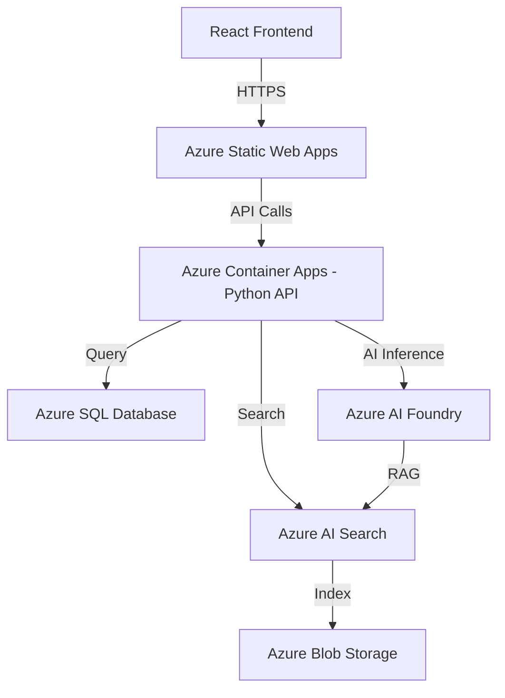

# Lab 3: Model Usage & Agents

## 🎯 Learning Objectives

By the end of this lab, you will:
- Understand the model catalog and how to choose the right model
- Make API calls with different parameters
- Build a basic AI agent with tool calling
- Generate architecture diagrams using AI models

---

## Model Catalog Overview

### Popular Models for Different Tasks (June 2026)

| Model | Best For | Context | Strengths |
|-------|----------|---------|-----------|
| **GPT-4.1** | Complex reasoning, coding, long-context | 1M tokens | SOTA coding & instruction-following, fine-tunable |
| **GPT-4.1-mini** | Cost-effective general tasks | 1M tokens | Fast, affordable, great quality |
| **GPT-4.1-nano** | Ultra-low-latency, edge scenarios | 1M tokens | Smallest/fastest in the 4.1 family |
| **GPT-4o** | Multimodal (text + image + audio) | 128K tokens | Real-time audio, vision, fastest multimodal |
| **o3** | Advanced math, logic, planning | 200K tokens | Deep chain-of-thought reasoning |
| **o4-mini** | Visual reasoning, cost-efficient reasoning | 200K tokens | Strong reasoning at lower cost |
| **gpt-image-1** | Image generation & editing | — | Text-to-image, inpainting, style transfer |
| **text-embedding-3-large** | Embeddings for RAG | 8K tokens | Best quality embeddings (3072 dimensions) |
| **text-embedding-3-small** | Cost-effective embeddings | 8K tokens | Good quality, lower cost (1536 dimensions) |
| **Phi-4** | On-device/edge AI | 16K tokens | Small, fast, open-source (Microsoft) |

> ⚠️ **Note:** DALL-E 3 was retired in early 2026. Use **gpt-image-1** (or gpt-image-1-mini) for all image generation tasks.

### Choosing a Model — Decision Matrix

```
Need complex reasoning/coding?  → GPT-4.1
Need it cheap & fast?           → GPT-4.1-mini or GPT-4.1-nano
Need multimodal (vision+audio)? → GPT-4o
Need deep math/logic reasoning? → o3 or o4-mini
Need image generation?          → gpt-image-1
Need embeddings for RAG?        → text-embedding-3-large (quality) or 3-small (cost)
Need code generation?           → GPT-4.1 (1M context, best for code)
Need diagram/visual?            → GPT-4.1 (Mermaid/PlantUML) + gpt-image-1
Need long documents (>128K)?    → GPT-4.1 (1M token context)
```

---

## 🖥️ Hands-On: API Parameters Deep Dive

### Exercise 1: Experiment with Temperature

```python
import os
from dotenv import load_dotenv
from openai import AzureOpenAI

load_dotenv()

client = AzureOpenAI(
    azure_endpoint=os.getenv("AZURE_OPENAI_ENDPOINT"),
    api_key=os.getenv("AZURE_OPENAI_API_KEY"),
    api_version="2025-04-01-preview"
)

prompt = "Write a one-line tagline for an AI hackathon."

# Try different temperatures
for temp in [0.0, 0.5, 1.0]:
    response = client.chat.completions.create(
        model=os.getenv("AZURE_OPENAI_DEPLOYMENT"),
        messages=[{"role": "user", "content": prompt}],
        temperature=temp,
        max_tokens=50
    )
    print(f"Temperature {temp}: {response.choices[0].message.content}")
```

### Exercise 2: Streaming Responses

```python
# Streaming — get tokens as they're generated (great for chat UIs)
stream = client.chat.completions.create(
    model=os.getenv("AZURE_OPENAI_DEPLOYMENT"),
    messages=[
        {"role": "system", "content": "You are a helpful assistant."},
        {"role": "user", "content": "Explain microservices architecture in 5 bullet points."}
    ],
    stream=True
)

print("Streaming response:")
for chunk in stream:
    if chunk.choices[0].delta.content:
        print(chunk.choices[0].delta.content, end="", flush=True)
print()
```

---

## 🤖 Building AI Agents

### What is an Agent?

An **AI Agent** is an autonomous system that can:
1. **Understand** user intent from natural language
2. **Plan** multi-step actions to accomplish goals
3. **Use tools** (search, code execution, APIs) to gather information
4. **Respond** with grounded, actionable answers

### Agent Architecture

```
User Query
    │
    ▼
┌─────────────────┐
│   Agent Brain   │ ← LLM (GPT-4o)
│  (Reasoning)    │
└────────┬────────┘
         │
    ┌────┴────┐
    │  Tools  │
    ├─────────┤
    │ • Code Interpreter    │
    │ • File Search (RAG)   │
    │ • Function Calling    │
    │ • Azure AI Search     │
    │ • Custom APIs         │
    └─────────────────────────┘
         │
         ▼
   Grounded Response
```

---

## 🖥️ Hands-On: Building Your First Agent

### Exercise 3: Basic Agent with Azure AI Foundry

```python
import os
from dotenv import load_dotenv
from azure.identity import DefaultAzureCredential
from azure.ai.projects import AIProjectClient
from azure.ai.projects.models import Agent, AgentThread, ThreadMessage, ThreadRun

load_dotenv()

# Initialize client
credential = DefaultAzureCredential()
client = AIProjectClient(
    endpoint=os.getenv("PROJECT_ENDPOINT"),
    credential=credential
)

# Step 1: Create an Agent
agent = client.agents.create_agent(
    model="gpt-4o",
    name="HackathonHelper",
    instructions="""You are a helpful hackathon assistant. You help developers 
    understand Azure AI services and write code. Be concise and practical.
    Always provide code examples when relevant."""
)
print(f"✅ Agent created: {agent.id}")

# Step 2: Create a conversation thread
thread = client.agents.create_thread()
print(f"✅ Thread created: {thread.id}")

# Step 3: Send a message
message = client.agents.create_message(
    thread_id=thread.id,
    role="user",
    content="How do I create a RAG pipeline with Azure AI Search? Give me the key steps."
)

# Step 4: Run the agent
run = client.agents.create_and_process_run(
    thread_id=thread.id,
    agent_id=agent.id
)

# Step 5: Get the response
if run.status == "completed":
    messages = client.agents.list_messages(thread_id=thread.id)
    for msg in reversed(messages.data):
        if msg.role == "assistant":
            print(f"\n🤖 Agent Response:\n{msg.content[0].text.value}")

# Cleanup
client.agents.delete_agent(agent.id)
print("\n🧹 Agent cleaned up.")
```

### Exercise 4: Agent with Code Interpreter Tool

```python
# Create an agent that can execute Python code
agent = client.agents.create_agent(
    model="gpt-4o",
    name="DataAnalyst",
    instructions="You are a data analyst. Use code interpreter to analyze data and create visualizations.",
    tools=[{"type": "code_interpreter"}]
)

# Ask it to do data analysis
message = client.agents.create_message(
    thread_id=thread.id,
    role="user",
    content="""Create a bar chart showing these quarterly sales:
    Q1: $45,000
    Q2: $52,000  
    Q3: $48,000
    Q4: $61,000
    Save it as a PNG file."""
)

run = client.agents.create_and_process_run(
    thread_id=thread.id,
    agent_id=agent.id
)

# The agent will execute Python code to create the chart
```

---

## 🎨 Architecture Diagram Generation

AI models can generate architecture diagrams in multiple ways:

### Method 1: Generate Mermaid Diagrams with GPT-4.1

```python
response = client.chat.completions.create(
    model="gpt-4.1",  # Best for code/structured output generation
    messages=[
        {"role": "system", "content": """You are an expert cloud architect. 
        When asked to create architecture diagrams, output them in Mermaid syntax.
        Use proper Mermaid graph notation with clear labels."""},
        {"role": "user", "content": """Create an architecture diagram for a 
        web application with:
        - React frontend on Azure Static Web Apps
        - Python API on Azure Container Apps
        - Azure SQL Database
        - Azure AI Foundry for AI features
        - Azure AI Search for RAG
        - Azure Blob Storage for documents"""}
    ],
    temperature=0.3
)

mermaid_code = response.choices[0].message.content
print(mermaid_code)

# Save to file — render with any Mermaid viewer (VS Code extension, mermaid.live)
with open("architecture.mmd", "w") as f:
    f.write(mermaid_code)
```

**Example output:**


### Method 2: Generate Images with gpt-image-1

```python
# Use gpt-image-1 for visual architecture diagrams
response = client.images.generate(
    model="gpt-image-1",
    prompt="""Create a clean, professional cloud architecture diagram showing:
    - A web browser connecting to Azure App Service
    - App Service connecting to Azure AI Foundry
    - Azure AI Foundry connecting to Azure AI Search
    - Azure AI Search connecting to Azure Blob Storage
    Use a modern flat design style with Azure blue colors.
    Include Azure service icons. White background.""",
    size="1024x1024",
    quality="high",
    n=1
)

image_url = response.data[0].url
print(f"🎨 Diagram generated: {image_url}")
```

### Method 3: Generate PlantUML with Code Interpreter

```python
# Use the agent with code interpreter to generate diagrams
message = client.agents.create_message(
    thread_id=thread.id,
    role="user",
    content="""Generate a PlantUML diagram for a microservices architecture with:
    - API Gateway
    - User Service
    - Order Service  
    - Payment Service
    - Message Queue between services
    Output the PlantUML code and also render it as a PNG using the plantuml library."""
)
```

---

## 🧪 Challenge Exercise

**Build a "Architecture Advisor" agent** that:
1. Takes a text description of an application
2. Recommends Azure services to use
3. Generates a Mermaid architecture diagram
4. Explains the data flow

```python
# Starter code for the challenge
advisor_agent = client.agents.create_agent(
    model="gpt-4o",
    name="ArchitectureAdvisor",
    instructions="""You are an Azure Solutions Architect. When given an application 
    description:
    1. Recommend the best Azure services
    2. Generate a Mermaid diagram showing the architecture
    3. Explain the data flow between components
    4. Note any scalability or security considerations
    
    Always output the Mermaid diagram in a code block with ```mermaid markers.""",
    tools=[{"type": "code_interpreter"}]
)
```

---

## ✅ Checkpoint

Before moving to the next lab, confirm:
- [ ] You can make API calls with different parameters (temperature, streaming)
- [ ] You've created and interacted with an agent
- [ ] You understand tool calling (code interpreter)
- [ ] You can generate architecture diagrams using GPT-4.1 (Mermaid)
- [ ] (Bonus) You've completed the Architecture Advisor challenge

---

**Next:** [Lab 4 — RAG (Retrieval-Augmented Generation) →](04-rag.md)
